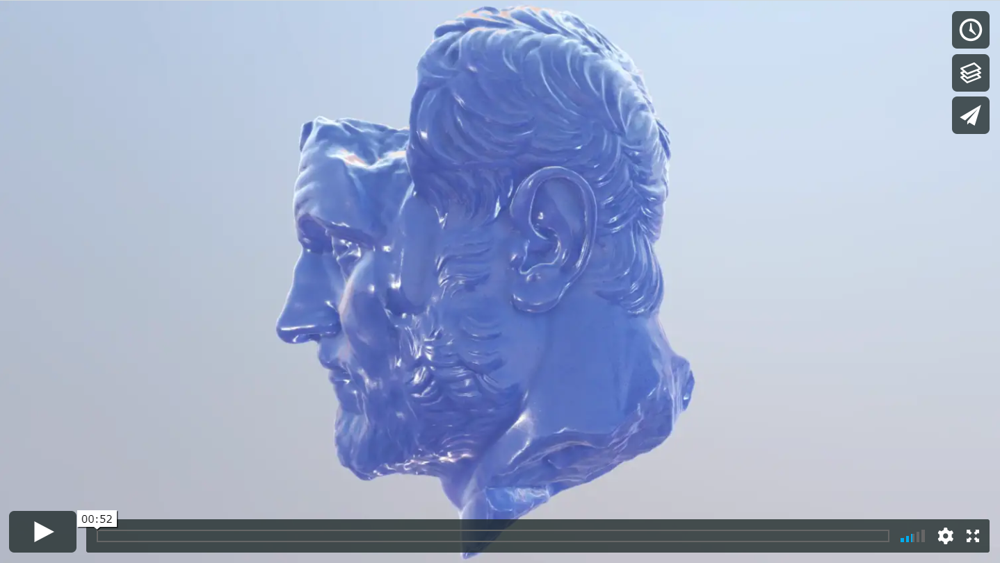

# SimplePBR

A Processing library providing physically based rendering and materials. Created by [Nacho Cossio](http://nachocossio.com) based on [a shader by Nick Galko](https://gist.github.com/galek/53557375251e1a942dfa)

WARNING!: At the moment it has been tested on Windows and Linux with nVidia graphics. The shader fails to compile on Intel integrated graphics and osX, probably related to [this Processing issue](https://github.com/processing/processing/issues/5507) . It is available in the 'src/data/shaders/pbr' folder if you want to try to fix it.

### Installing
Download the latest [release from here](https://github.com/kosowski/SimplePBR/releases/download/v0.2/SimplePBR.zip) and unzip the 'SimplePBR' folder into your Processing 'libraries' folder.

### Getting Started
Physically Based Rendering (PBR) is a method of shading and rendering that provides a more accurate representation of how light interacts with surfaces. A nice introduction on what PBR is and the different lighting terms involved can be found in these article series by the jMonkey Engine team:
https://wiki.jmonkeyengine.org/jme3/advanced/pbr_part1.html

Two kinds of assets are required for PBR:
- Cubemap, and in this case, several prefiltered versions of it, for the indirect lighting. One set is provided with the library, taken from the [sIBL archive](http://www.hdrlabs.com/sibl/archive.html), under Creative Commons Attribution-Noncommercial-Share Alike 3.0 License. The radiance and irradiance maps were created with [Cmft Studio](https://github.com/dariomanesku/cmftStudio), which is easy to use and very fast.

- Materials: sets of textures defining the characteristics of a certain substance. SimplePBR uses individual textures for easy of use, although is a better practice to group several of these textures into the RGBA channels of one texture. There are  various sites providing free materials, there are three materials included with the examples taken from [3dtextures](https://3dtextures.me/) and [CC0textures](https://cc0textures.com/) There is also a "textureless" material using just numerical constant values.

### License

This project is licensed under the MIT License - see the [LICENSE.md](LICENSE.md) file for details

### Donate

If you use this library for commercial work, please consider donating

